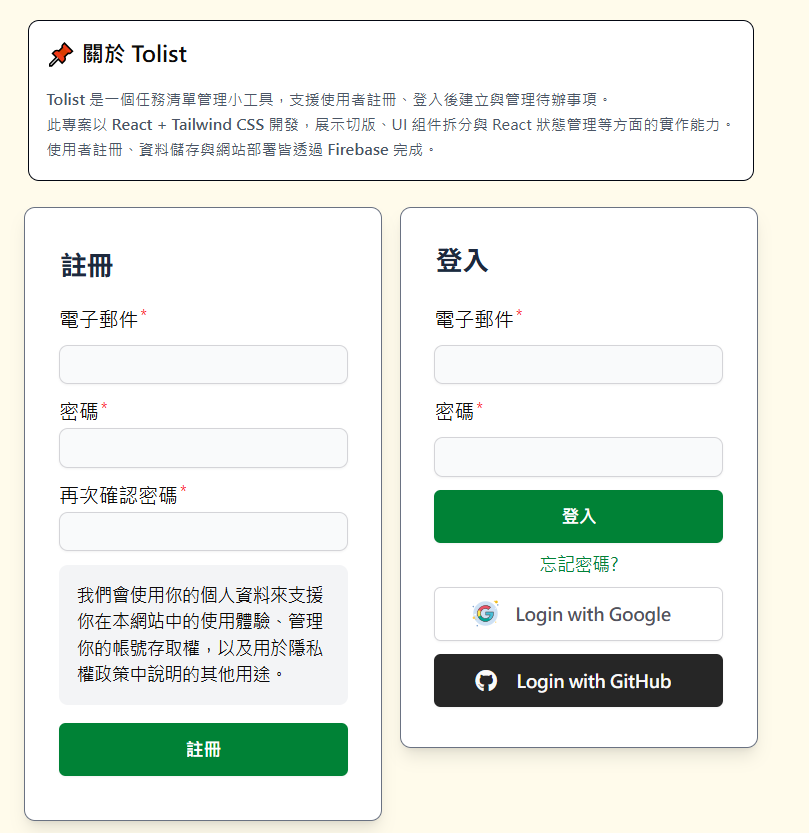
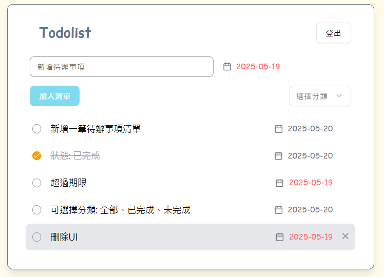

# 關於 Tolist
**Todolist** 是一個任務清單管理小工具，支援使用者註冊、登入後建立與管理待辦事項。

## 網站連結
### 📝 開始使用
[https://todolist-cd951.web.app/](https://todolist-cd951.web.app/)

## 使用技術
### 🚧 前端框架與 UI
- Vite + React 18 + TypeScript
- React Router v7
- Tailwind CSS
- Tailwind Scrollbar
- shadcn/ui
- Zod

### ☁️ Firebase 雲端服務
- Firebase Authentication（使用者驗證）
- Firestore（雲端 NoSQL 資料庫）
- Firebase Hosting（靜態網站託管）

## 📸 Screenshots
### 🖥️ 登入畫面

### 📂 主要頁面
